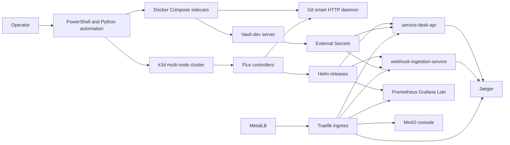
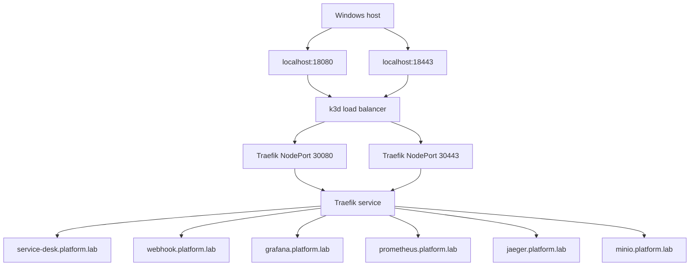

# Architecture

## Enterprise-Core v1 Scope

This repository intentionally stops at the first strong enterprise-core milestone:

- multi-node `k3d` cluster running `k3s`
- `Flux`-driven reconciliation from a local Git smart HTTP source
- `Helm`-managed workloads
- `MetalLB` + `Traefik` for ingress and service exposure
- `Vault` + `External Secrets` for secret injection
- `MinIO` with persistent volume
- `Prometheus`, `Grafana`, `Loki`, `Jaeger`
- workload rollout/failure/rollback drill

`Rancher`, `GitLab`, `Harbor`, `Longhorn`, and `Istio` are intentionally left for the next wave.

## Platform Diagram

## Network Diagram

## Secret Flow

1. `scripts/seed-vault.ps1` writes demo secrets into `Vault`.
2. `ClusterSecretStore enterprise-vault` points `External Secrets` to `Vault`.
3. `ExternalSecret` resources materialize Kubernetes secrets in workload namespaces.
4. Workloads read those secrets through standard `secretKeyRef` env vars.

## GitOps Flow

1. Source manifests live in `flux/` and `helm/`.
2. `scripts/bootstrap-gitops-repo.ps1` creates a bare repo and worktree for the demo Git source.
3. `scripts/push-gitops.ps1` syncs source manifests into the worktree and pushes to the bare repo.
4. `Flux` reads `GitRepository platform-repo`.
5. `Kustomization enterprise-platform` applies the desired state.
6. `HelmRelease` resources reconcile workloads and platform components.

## Failure and Recovery Story

The reproducible drill uses `scripts/demo-rollout.ps1`:

- `release`: bumps `service-desk-api` app version and waits for Flux to apply the new revision
- `break`: changes the canonical ingress host so the public route fails visibly
- `rollback`: reverts the last bad commit and waits until the healthy route returns

This is deliberately simple, but it is observable and operator-friendly.
